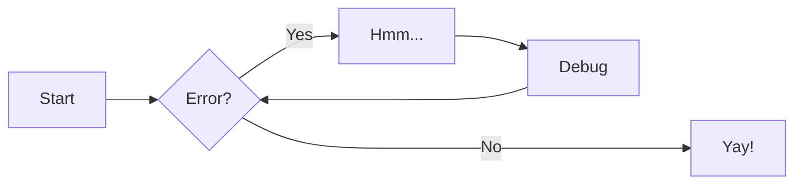

# Mermaid diagrams

Here's the example from [MkDocs Material documentation](https://squidfunk.github.io/mkdocs-material/reference/diagrams/#using-flowcharts): 

Do nonsense diagrams come over?  I assume not
![[docs/Features/Untitled Diagram.svg]]

